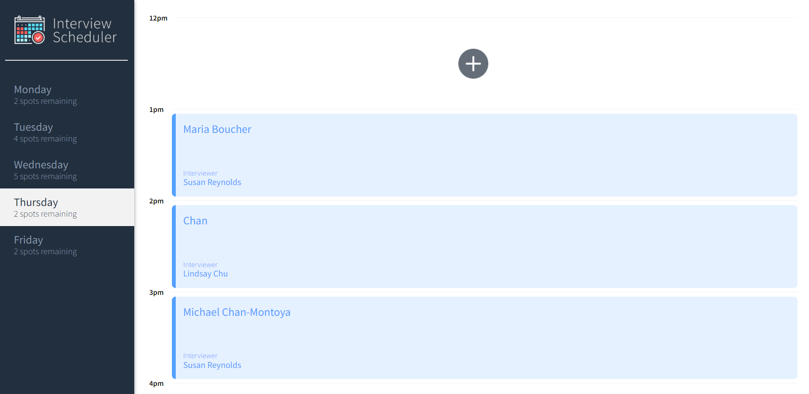
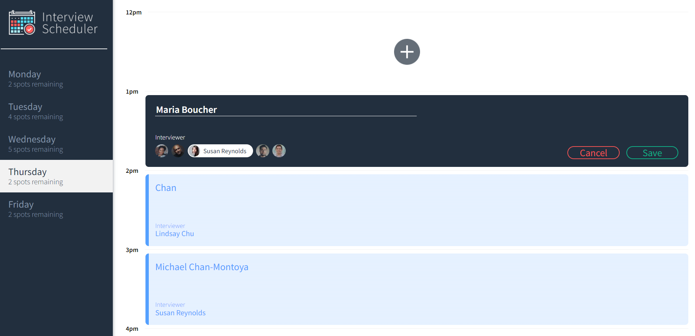
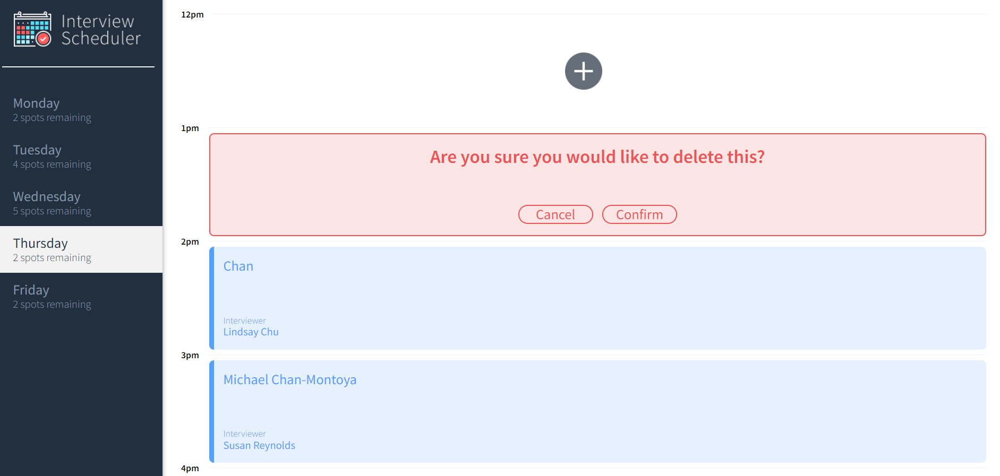

# Interview Scheduler
This is a interview Schedulr built with React, SASS, Storybook and Test driven by JEST.
Cooperating with the [Scheduler Api](https://github.com/lighthouse-labs/scheduler-api), it allow the user to cooperate with Postgres database and manage interviews between 
students and interviewers.

#### Main Interface

#### Create Interviews with Daily Interviewer Selections



#### Delete Interview if Somthing is not Right



## Setup

Install dependencies with `npm install`.

Install [Scheduler Api](https://github.com/lighthouse-labs/scheduler-api). Follow the instruction to setup the server and the environment variable for this app.

## Running Webpack Development Server

```sh
npm start
```

## Running Jest Test Framework

```sh
npm test
```

## Running Storybook Visual Testbed

```sh
npm run storybook
```
